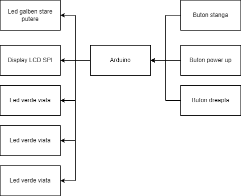
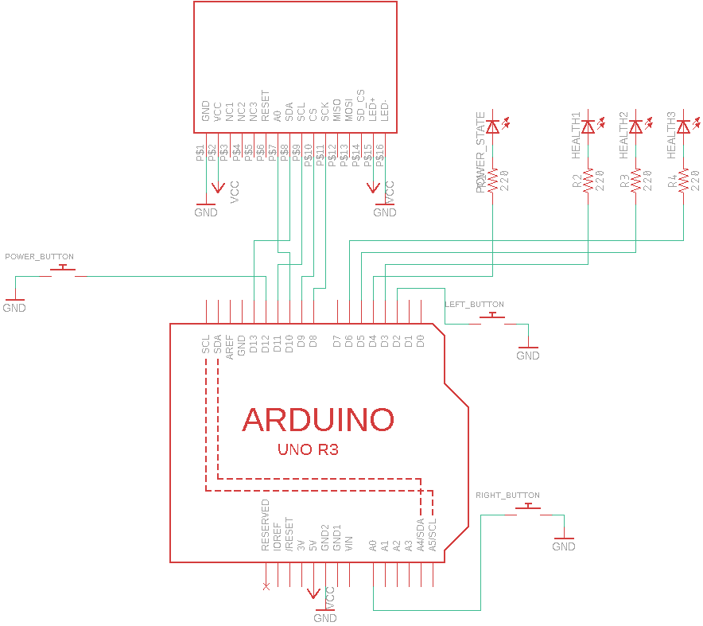

# Meteor Dodge

## Introducere ##

Meteor Dodge este un joc despre o nava spatiala care trebuie sa se fereasca de meteoritii din drumul ei. 

Nava se va deplasa stanga-dreapta si va putea trage la un anumit intereval de timp pentru a sparge meteoritul din fata ei. Jocul in sine va fi afisat pe un display LCD SPI, starea power-up ului de tragere va fi determinata de stadiul de luminare a unui led galben, iar controlul navei se va face folosind 3 butoane. Nava va avea de asemenea 3 vieti afisate prin led-uri verzi, iar contactul cu un meteorit va scade o viata. 

Scopul jocului este de a feri nava cat mai mult timp de meteoriti si de a obtine un scor cat mai mare.

## Descriere generală

### Schema bloc

Jocul propriu-zis va fi afisat pe un display LCD SPI. Starea power up-ului va fi afisata printr-un led galben, iar vietile for fi afisate prin 3 led-uri verzi.

Nava va putea fi controlata prin 3 butoane: 2 pentru deplasarea stanga-dreapta, si unul care activeaza power up-ul sau care restarteaza jocul daca runda anterioara a fost pierduta.

### Hardware Design

Componente folosite in implementarea proiectului:
  * Arduino UNO R3
  * Display LCD SPI 1.8 inch
  * 1 led galben
  * 3 led-uri verzi
  * 3 butoane

### Schema electrica

## Software Design

Partea software a proiectului a fost implementata in [Arduino IDE](https://www.arduino.cc/en/software) iar pentru comunicarea cu display-ul 
LCD SPI am folosit bibliotecile interne **SPI** si **TFT**.

Din punct de vedere software implementarea proiectului este destul de ampla, si poate fi impartita in 2 sectiuni, **game loop** si **intreruperi**.

### Game Loop

In cadrul **game loop-ului** am implementat logica principala a jocului, asemanatoare cu ce se facea la implementarea temelor de la EGC. Din nou,
aceasta parte poate fi impartita in urmatoarele categorii:
  * Verificari daca jocul a inceput sau s-a terminat
  * Actualizarea pozitiilor entitatilor
  * Detectarea coliziunilor
  * Stergerea entitatilor din pozitia anterioara
  * Desenarea entitatilor

Initial, jocul va incepe doar daca se apasa pe butonul de power, asociat unei intreruperi externe. In cadrul rularii jocului, daca nava se 
loveste de 3 meteoriti, jocul se termina si se va afisa pe ecran scorul. Pentru a incepe din nou jocul, trebuie apasat iar pe butonul de power.

In cadrul jocului exista 3 tipuri de entitati: **meteoriti**, **nava** si **laserul navei**.

In prima faza din game loop sunt actualizate pozitiile entitatilor. Meteoritii sunt luati la rand dintr-un array si este actualizata pozitia lor (coboara mai jos cu 5 pixeli), sau se sterg de pe display daca au parcurs o distanta prea mare, pentru a face loc altor meteoriti. Laserul navei se actualizaza (in cazul in care nava a tras) pana cand loveste un meteorit sau iese din ecran. Cooldown-ul laserului este de fapt timpul pana cand laserul ajunge de la nava la marginea de sus a ecranului. Pozitia navei este actualizata prin declansarea unor interuperi externe, despre care voi vorbi mai jos.

In a doua faza se verifica coliziunile. Marginea de coliziune a tuturor entitatilor este aproximata folosind cercuri. 
Exista 2 tipuri de coliziuni: **laser-meteorit** si **nava-meteorit**. La coliziunile laser-meteorit, se iau la rand meteoritii existenti si se verifica daca laserul atinge vreunul din ei. La coliziunile nava-meteorit, se iau la rand toti meteoritii si se verifica daca ating nava. In cazul incare nava atinge 3 meteoriti, jocul se termina. 

In a treia faza se sterg entitatile din pozitia anterioara. Acest proces este optimizat pe cat posibil, pentru ca nici placa arduino nu are o putere de calcul foarte mare, si nici display-ul nu are cele mai bune specificatii, deci nu se poate face flush la tot ecranul, dupa care sa desenezi din nou toate entitatile pe ecran, pentru ca ar merge foarte incet. De aceea, pentru laser si meteoriti este stearsa doar pozitia anterioara (care este usor de calculat/prevazut), iar pozitia anterioara a navei se sterge doar daca in acea iteratie de game loop nava s-a miscat.

In faza finala din game loop se deseneaza toate entitatile la noile lor pozitii. Nava si laser-ul au niste desene mai interesante (nava este desenata pixel cu pixel, in total vreo 100 linii de cod), insa meteoritii sunt desenati prin niste simple cercuri, tot din motive de performanta.

### Intreruperi

In cadrul jocului exista 4 tipuri de intreruperi:
  * Intrerupere de timer pentru meteoriti
  * Intrerupere externa pentru laser/pornire joc
  * Intrerupere externa deplasare stanga
  * Intrerupere externa deplasare dreapta

Intreruperea de timer (TIMER1_COMPA) este declansata de catre timerul 1 si este folosita pentru generarea meteoritilor. De asemenea, pe masura ce jocul avanseaza, aceasta intrerupere mareste **scorul** dar si **dificultatea** jocului.

Intreruperea externa pentru laser/pornire joc (PCINT0) este asociata butonului din mijlocul breadboard-ului si declanseaza trasul cu laserul daca jocul este in starea de running sau porneste jocul daca nu este pornit deja.

Intreruperile externe de deplasare (PCINT1, PCINT2) declanseaza deplasarea navei la stanga sau la dreapta.

## Rezultate Obţinute

In final a iesit un joc distractiv, bine pus la punct de tip arcade. Singurul lucru de care nu sunt foarte mandru este cable management-ul, dar
din acest punct de vedere nu am foarte multe optiuni.

===Media===

## Bibliografie/Resurse

  * [Video-ul folosit pentru conectarea ecranului LCD SPI](https://www.youtube.com/watch?v=72SrQuVU3Ww)
  * [Documentatie biblioteca TFT](https://www.arduino.cc/reference/en/libraries/tft/)
  * [Documentatie coliziuni](https://developer.mozilla.org/en-US/docs/Games/Techniques/2D_collision_detection)
  * Laboratoarele de pe ocw (in special cele cu timere si intreruperi)
  * https://cleste.ro/